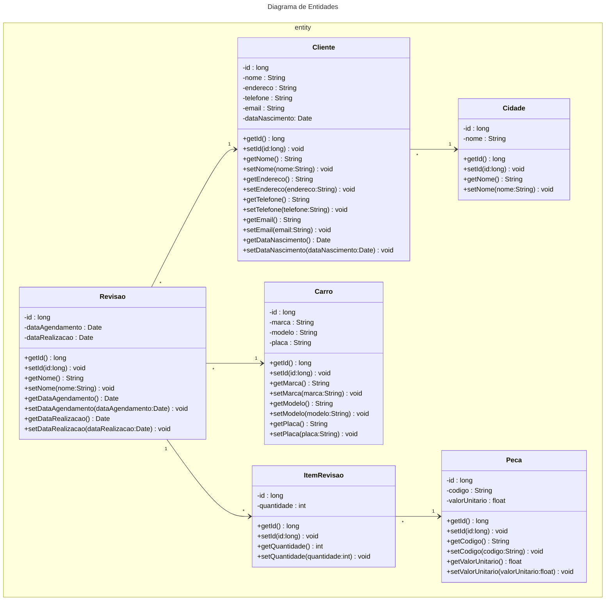
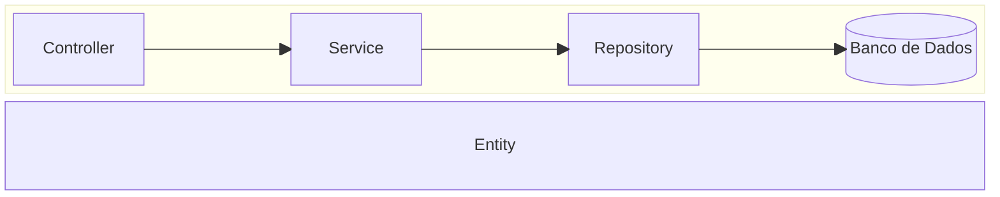

# Fábrica de Software 2025/1
Nome da equipe 


## Lista de Equipes/Projetos
- [Clara Meister Martinovsky e Guilherme Torres Fiedler (claramartinovsky/fabsoft-2025-2)](https://github.com/claramartinovsky/fabsoft-2025-2)
- [Edson e Gustavo edsonjunior23/fabsoft-2025-02:](https://github.com/edsonjunior23/fabsoft-2025-02)
- [Fellipe N. Prim e Lucas Felipe (fellipe-prim/fabsoft-2025-2)](https://github.com/fellipe-prim/fabsoft-2025-2)
- [Gian Carlo Fiamoncini e Carlos Alberto (gianfiamonciniuniville/fabsoft-2025-2)](https://github.com/gianfiamonciniuniville/fabsoft-2025-2)
- [Leonardo e Satty (hamsterbr/fabsoft-2025-2)](https://github.com/hamsterbr/fabsoft-2025-2)
- [Caio (ijustgotanidea/fabsoft-2025-2)](https://github.com/ijustgotanidea/fabsoft-2025-2)
- [Cleverson Santos (Cleverson-Santoss/fabsoft-2025-2)](https://github.com/Cleverson-Santoss/fabsoft-2025-2)
- [João Victor Corrêa Palhano (JoaoPalhano07/fabsoft-2025-2)](https://github.com/JoaoPalhano07/fabsoft-2025-2)
- [Jandir Neto e Lucas Bobato (Lucas-Bobato/fabsoft-2025-2)](https://github.com/Lucas-Bobato/fabsoft-2025-2)
- [Lucas Bigas Padilha (LucasBigas/fabsoft-2025-2)](https://github.com/LucasBigas/fabsoft-2025-2)
- [Mario (Marioo-Jr/fab-soft-2025-2)](https://github.com/Marioo-Jr/fab-soft-2025-2)
- [Pedro Henrique A. Alves (pedrohaalves/fabsoft-2025-2)](https://github.com/pedrohaalves/fabsoft-2025-2)
- [Pedro Henrique Placidina Maria (PedroPlacidina/fabsoft-2025-2)](https://github.com/PedroPlacidina/fabsoft-2025-2)
- [Bruno Deud e Reidner (ReidnerFausto/fabsoft-2025-2)](https://github.com/ReidnerFausto/fabsoft-2025-2)
- [Wellington Grein (WellingtonGr3in/fabsoft-2025-2)](https://github.com/WellingtonGr3in/fabsoft-2025-2)
- [Guilherme Passos de Borba (xltgui/fabsoft-2025-2)](https://github.com/xltgui/fabsoft-2025-2)


## Propostas de projeto
<s>
  
- Nome do sistema Ex:(Sistema para Mecânica)
  - Funcionalidade 1 Cadastrar dados do Cliente
  - Funcionalidade 2 Cadastrar veículos
  - Funcionalidade 3

</s>

- Nome do sistema Ex:(Sistema para Mecânica)
  - Funcionalidade 1 Cadastrar dados do Cliente
  - Funcionalidade 2 Cadastrar veículos
  - Funcionalidade 3

## Aula 05/08

- JRE - Java Runtime Enviroment
  - Ambiente mínimo para executar um programa Java
  - JVM - Java Virtual Machine (java.exe ou javaw.exe)

- JDK - Java Development Kit
  - [Adoptium JDK](https://adoptium.net/pt-BR)
  - Ambiente de DESENVOLVIMENTO (javac.exe) compilador

- COMPILAÇÃO
  1) Escreve um programa em java (arquivo.java)
  2) Compilação arquivo.java -> javac.exe -> bytecode arquivo.class
- EXECUÇÃO
  3) Passar .class -> java.exe (JVM) -> ling máquina

- VSCode
  - [VSCode](https://code.visualstudio.com/)
  - [Java Extension Pack](https://marketplace.visualstudio.com/items?itemName=vscjava.vscode-java-pack)

## Aula 12/08

- Definir as histórias de usuario [EXEMPLOS](https://engsoftmoderna.info/cap3.html#hist%C3%B3rias-de-usu%C3%A1rios)

### Histórias de Usuário

- Como um funcionário eu gostaria de cadastrar um cliente
- Como um funcionário eu gostaria de editar um cliente
- Como um funcionário eu gostaria de excluir um cliente

## Aula 19/08
## Diagrama de entidades

- [Extensão Mermaid](https://marketplace.visualstudio.com/items?itemName=vstirbu.vscode-mermaid-preview)
- [Mermaid ClassDiagram](https://github.com/mermaid-js/mermaid/blob/develop/packages/mermaid/src/docs/syntax/classDiagram.md)

| Type    | Description   |
| ------- | ------------- |
| `<\|--` | Inheritance   |
| `*--`   | Composition   |
| `o--`   | Aggregation   |
| `-->`   | Association   |
| `--`    | Link (Solid)  |
| `..>`   | Dependency    |
| `..\|>` | Realization   |
| `..`    | Link (Dashed) |





## Aula 28/08

- Git (Branchs)

```bash 
git checkout -b nome-branch
```

[conventionalcommits](https://www.conventionalcommits.org/en/v1.0.0/)

```bash 
git add .
git commit -m "mensagem"
git push --set-upstream origin nome-branch
```

## Aula 04/09

### Clean Architecture


### Diagrama de Camadas


# 2 Bimestre

## Aula 07/10

-[DEVOPS](https://learn.microsoft.com/en-us/training/modules/introduction-to-devops/2-what-is-devops)

-[Containers Docker](https://learn.microsoft.com/en-us/training/modules/intro-to-docker-containers/)


### Dockerfile
```bash
# Etapa 1: Build
FROM maven:3.9.11-eclipse-temurin-21 AS build

# Define o diretório de trabalho
WORKDIR /app

# Copia o arquivo pom.xml e as dependências
COPY pom.xml ./
RUN mvn dependency:go-offline -B

# Copia o restante do código da aplicação
COPY src ./src

# Compila o projeto e gera o arquivo JAR
RUN mvn clean package -DskipTests

# Etapa 2: Produção
FROM eclipse-temurin:21-jre-alpine AS production

# Define o diretório de trabalho
WORKDIR /app

# Copia o arquivo JAR gerado na etapa de build
COPY --from=build /app/target/*.jar app.jar

# Define o profile ativo como 'dev'
#ENV SPRING_PROFILES_ACTIVE=dev

# Expõe a porta padrão do Spring Boot
EXPOSE 8080

# Comando para iniciar a aplicação
CMD ["java", "-jar", "app.jar"]
```

- [GitHub Actions](https://learn.microsoft.com/en-us/training/modules/introduction-to-github-actions/)

### .github/workflows/buildbackend.yml

```yaml
name: Build Backend

on:
  push:
    branches:
      - main

jobs:
  build-and-push:
    runs-on: ubuntu-latest

    steps:
      # Checkout the repository
      - name: Checkout Code
        uses: actions/checkout@v3

      # Log in to GitHub Container Registry
      - name: Log in to GitHub Container Registry
        uses: docker/login-action@v2
        with:
          registry: ghcr.io
          username: ${{ github.actor }}
          password: ${{ secrets.GITHUB_TOKEN }}

      # Build and push Docker image to GitHub Container Registry
      - name: Build and Push Docker Image
        run: |
          docker build -t ghcr.io/${{ github.repository }}/projfabsoft:${{ github.run_number }} ./fabsoft-backend
          docker push ghcr.io/${{ github.repository }}/projfabsoft:${{ github.run_number }}
```

## OpenAPI - Swagger
- Alterar o arquivo pom.xml do projeto backend para incluir a dependencia
```xml
<dependency>
  <groupId>org.springdoc</groupId>
  <artifactId>springdoc-openapi-starter-webmvc-ui</artifactId>
  <version>2.1.0</version>
</dependency>
```

## Frontend Angular

- Criar o projeto Angular
```bash
ng new fabsoft-frontend
```

- Acessar a pasta do projeto

```bash
cd fabsoft-frontend
```

- Executar o servidor do Angular

```bash
ng serve
```
- Para acessar o frontend utilize o link [http://localhost:4200](http://localhost:4200)

- Instalação do Bootstrap

```bash
npm install bootstrap
```

- No arquivo angular.json [🔗](./fabsoft-frontend/angular.json)

```json
"styles": [
    "src/styles.css",
    "node_modules/bootstrap/dist/css/bootstrap.css"
],
"scripts": [
    "node_modules/bootstrap/dist/js/bootstrap.js"
]
```
### Gerando a primeira tela de Cliente 

- Gerando o componente do Angular

```bash
ng generate component cliente.component
```

- Criando a interface gráfica HTML /src/app/cliente/cliente.component.html [🔗](./fabsoft-frontend/src/app/cliente/cliente.component.html)

```html
<main class="container">
    <table class="table">
        ....
    </table>
</main>
```

- Criando a classe Model

```bash
ng generate class model/cliente
```

- Código da classe /src/app/model/cliente.ts [🔗](./fabsoft-frontend/src/app/model/cliente.ts)

```ts
export class Cliente {
    id: number;
    nome: string;
    endereco: string;
    telefone: string;
    email: string;
    dataNascimento: Date;
}
```

- Configurar o arquivo tsconfig.json [🔗](./fabsoft-frontend/tsconfig.json) para suportar a não inicialização dos atributos 

```bash
"compilerOptions": {
    "strictPropertyInitialization": false,
} 
```

- Gerar o serviço

```bash
ng generate service service/cliente.service
```

- Codigo do serviço /src/app/service/cliente.service.ts [🔗](./fabsoft-frontend/src/app/service/cliente.service.ts)

```ts
import { Injectable } from '@angular/core';
import { Cliente } from '../model/cliente';
import { HttpClient } from '@angular/common/http';


@Injectable({
  providedIn: 'root'
})
export class ClienteService {
  apiURL = "http://localhost:8080/api/v1/clientes";
  
  constructor(private http:HttpClient) { }

  getClientes(){
    return this.http.get<Cliente[]>(this.apiURL);
  }

}
```

- Alterar o arquivo /src/app/app.component.html [🔗](./fabsoft-frontend/src/app/app.component.html) para gerar apenas a tela dos componentes

```html
<router-outlet />
```

- Modificar o código do componente /src/app/cliente/cliente.component.ts [🔗](./fabsoft-frontend/src/app/cliente/cliente.component.ts) para chamar o serviço e guardar a lista de clientes em um atributo

```ts
import { Component } from '@angular/core';
import { Cliente } from '../model/cliente';
import { ClienteService } from '../service/cliente.service';
import { HttpClientModule } from '@angular/common/http';
import { CommonModule } from '@angular/common';

@Component({
  selector: 'app-cliente',
  imports: [HttpClientModule,CommonModule],
  templateUrl: './cliente.component.html',
  styleUrl: './cliente.component.css',
  providers: [ClienteService]
})
export class ClienteComponent {
  listaClientes: Cliente[] = [];

  constructor(private clienteService: ClienteService) {}

  ngOnInit() {
    console.log("Carregando clientes...");
    this.clienteService.getClientes().subscribe(clientes => {
      this.listaClientes = clientes;
    });
  }
}
```

- Modificar o arquivo /src/app/cliente/cliente.component.html [🔗](./fabsoft-frontend/src/app/cliente/cliente.component.html) para desenhar a tabela de clientes

```html
<main class="container">
    <h2>Clientes</h2>
    <table class="table">
        <thead>
            <tr>
                <th>Nome</th>
            </tr>
        </thead>
        <tbody>
            <tr *ngFor="let umCliente of listaClientes">
                <td>{{umCliente.nome}}</td>
            </tr>
        </tbody>
    </table>
</main>
```

- Modificar o arquivo /src/app/app.routes.ts [🔗](./fabsoft-frontend/src/app/app.routes.ts) para incluir a rota para o componente

```ts
import { Routes } from '@angular/router';
import { ClienteComponent } from './cliente/cliente.component';
export const routes: Routes = [
    { path: 'clientes', component: ClienteComponent }
];
```

- Rodar a aplicação

```bash
ng serve
```

- Rodar a aplicação

```bash
ng serve
```

- [Cross-origin resource sharing](https://pt.wikipedia.org/wiki/Cross-origin_resource_sharing)

- No projeto Backend Java Spring Boot crie um pacote chamado br.univille.projfabsoft.config, e dentro dele uma classe WebConfig.java [🔗](./projfabsoft/src/main/java/br/univille/projfabsoft/config/WebConfig.java) com o seguinte código:


```java
package br.univille.fabsoft_backend.config;

import org.springframework.context.annotation.Configuration;
import org.springframework.web.servlet.config.annotation.CorsRegistry;
import org.springframework.web.servlet.config.annotation.EnableWebMvc;
import org.springframework.web.servlet.config.annotation.WebMvcConfigurer;

@Configuration
@EnableWebMvc
public class WebConfig implements WebMvcConfigurer  {

    @Override
    public void addCorsMappings(CorsRegistry registry) {
        registry.addMapping("/**")
                .allowedHeaders("*")
                .allowedOriginPatterns("*")
                .allowedOrigins("*")
                .allowedMethods("*")
                .maxAge(1800);

    }
}
```
## Criação da tela de cadastro de clientes

- Alterar o arquivo /src/app/cliente/cliente.component.ts para importar o Router e criar a função novo()

```ts
import { Router } from '@angular/router';

@Component({
  selector: 'app-cliente',
  imports: [HttpClientModule, CommonModule],
  templateUrl: './cliente.component.html',
  styleUrl: './cliente.component.css',
  providers: [ClienteService, Router]
})

constructor(
    private clienteService:ClienteService,
    private router:Router
){}
novo(){
  this.router.navigate(['clientes/novo']);
}    
```
- Alterar o arquivo /src/app/cliente/cliente.component.html criar o botao para a nova tela de formulário

```html
<a (click)="novo()" class="btn btn-primary">Novo</a>
```

- Alterar o arquivo /app/app.routes.ts para registrar a rota da nova tela

```ts
import { Routes } from '@angular/router';
import { ClienteComponent } from './cliente/cliente.component';
import { FormClienteComponent } from './form-cliente/form-cliente.component';

export const routes: Routes = [
    { path: 'clientes', component: ClienteComponent},
    { path: 'clientes/novo', component: FormClienteComponent},
];
```

- Abrir o console e digitar o comando para criar um novo componente que será a tela de cadastro

```bash
ng generate component form-cliente
```