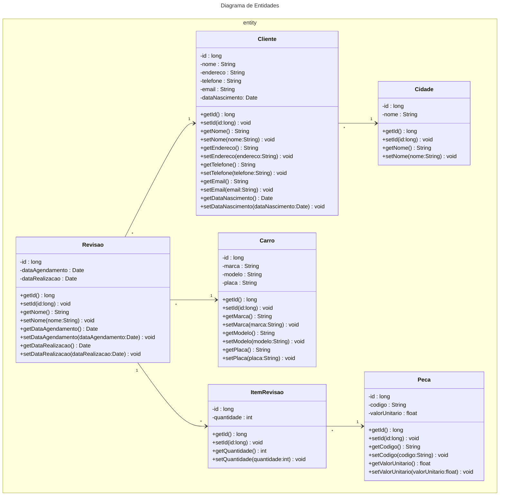
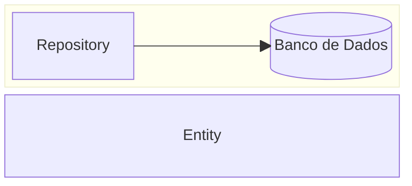

# Fábrica de Software 2025/1
Nome da equipe 

## Propostas de projeto
<s>
  
- Nome do sistema Ex:(Sistema para Mecânica)
  - Funcionalidade 1 Cadastrar dados do Cliente
  - Funcionalidade 2 Cadastrar veículos
  - Funcionalidade 3

</s>

- Nome do sistema Ex:(Sistema para Mecânica)
  - Funcionalidade 1 Cadastrar dados do Cliente
  - Funcionalidade 2 Cadastrar veículos
  - Funcionalidade 3

## Aula 05/08

- JRE - Java Runtime Enviroment
  - Ambiente mínimo para executar um programa Java
  - JVM - Java Virtual Machine (java.exe ou javaw.exe)

- JDK - Java Development Kit
  - [Adoptium JDK](https://adoptium.net/pt-BR)
  - Ambiente de DESENVOLVIMENTO (javac.exe) compilador

- COMPILAÇÃO
  1) Escreve um programa em java (arquivo.java)
  2) Compilação arquivo.java -> javac.exe -> bytecode arquivo.class
- EXECUÇÃO
  3) Passar .class -> java.exe (JVM) -> ling máquina

- VSCode
  - [VSCode](https://code.visualstudio.com/)
  - [Java Extension Pack](https://marketplace.visualstudio.com/items?itemName=vscjava.vscode-java-pack)

## Aula 12/08

- Definir as histórias de usuario [EXEMPLOS](https://engsoftmoderna.info/cap3.html#hist%C3%B3rias-de-usu%C3%A1rios)

### Histórias de Usuário

- Como um funcionário eu gostaria de cadastrar um cliente
- Como um funcionário eu gostaria de editar um cliente
- Como um funcionário eu gostaria de excluir um cliente

## Aula 19/08
## Diagrama de entidades

- [Extensão Mermaid](https://marketplace.visualstudio.com/items?itemName=vstirbu.vscode-mermaid-preview)
- [Mermaid ClassDiagram](https://github.com/mermaid-js/mermaid/blob/develop/packages/mermaid/src/docs/syntax/classDiagram.md)

| Type    | Description   |
| ------- | ------------- |
| `<\|--` | Inheritance   |
| `*--`   | Composition   |
| `o--`   | Aggregation   |
| `-->`   | Association   |
| `--`    | Link (Solid)  |
| `..>`   | Dependency    |
| `..\|>` | Realization   |
| `..`    | Link (Dashed) |





## Aula 28/08

- Git (Branchs)

```bash 
git checkout -b nome-branch
```

[conventionalcommits](https://www.conventionalcommits.org/en/v1.0.0/)

```bash 
git add .
git commit -m "mensagem"
git push --set-upstream origin nome-branch
```

## Aula 04/09

### Clean Architecture


### Diagrama de Camadas


